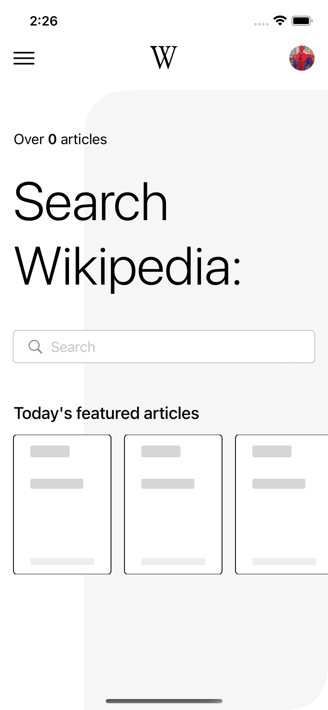
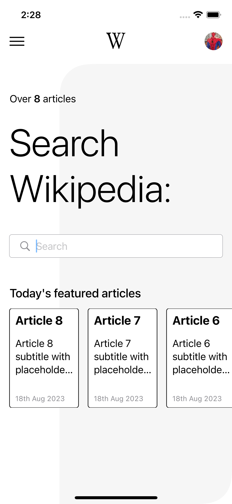
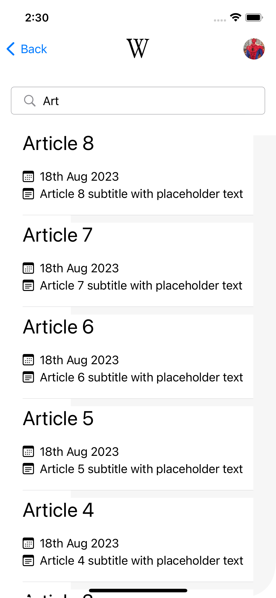
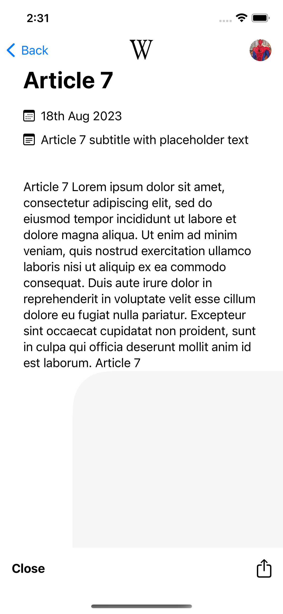

# Pulselive-Interview-Task

### Structure
- I have chosen to use MVVM as that is the pattern I have the most experience in and it is the most readable/organized one.
- I have broken the project into sections of the app such as List (Homepage), Details (Item Details) and Search, each consisting of any ViewModels & Views corresponding to the page.
- I have an Infrastructure folder which would contain files such as AppDelegate, BaseClasses, Navigation, Notifications etc.
- I have moved the services into their own target to keep it away from the main application and not clutter it though I would name it something other than `interview-services`

### Services
- I have chosen to use Combine for 2 reasons:
    1: Combine is a bit older and will most likely be used in more projects.
    2: The job required it and I wanted to showcase that I know how to use it (By no means am I an expert)
    
- I would've probably used async/await for this it would have been far simpler and for what I had to do it would've been more than acceptable.
- Overall I would use Combine when dealing with more complex data streams and handling multiple publishers that need to be composed.

### Tests
- In an actual app I would've used a framework such as Mockingbird to create mocks of each service rather than make them myself.
- Writing Snapshot Tests:
    - I would've created some snapshot tests as a simple and quick way of checking that everything looks good
    - Though this can be a bit temperamental from my experience and I have personally removed it from the build & test pipeline, it has its own test pipeline which I check whenever it fails as a simple iOS or XCode version seems to break it.
- Writing UITests would be a must in order to verify the flow of the app is still functioning and that nothing has been missed or broken during any UI work.

### Overall
- With the data provided by the API I had to go down a text design route and kind of picked a version of Wikipedia since they are mainly text.
- I have chosen to use SwiftUI as it allows for faster development, though it has its downsides such as Navigation.
- I haven't implemented it but for navigation, I could've used Coordinators and ended up following the MVVM-C pattern.
- In an actual application I would think about accessibility as well and the less fortunate and how to better help them navigate the app.

### PS:
- I have spent around a day and a half and this is the breakdown: 
    - Coming up with a design (Ended up using some Dribble shots)
    - Deciding between MVVM or the traditional route
    - Deciding between Combine or Async/Await
    - The actual development
    - Writing UnitTests
    
- I hope I haven't missed anything :D

### Missed:
- Better error handling
    - In my sink operators if an error is returned aside from logging it in, I could've displayed an error message and let the user retry
- Tests
    - Rename ItemsServicesTests to ItemsServicesMock
    - Add some more tests around the Util files I create such as Date+Extension
    - Add some tests for the service itself not just the ViewModel
- Naming files and variables. Because of the limited data provided, I used generic names

### TOOLS
- XCode: 14.3.1
- iOS: 16.0
    
### Screenshots

|   |   |   |
| ------------------------ | ------------------------ | ------------------------ |
|   |   |                          |
